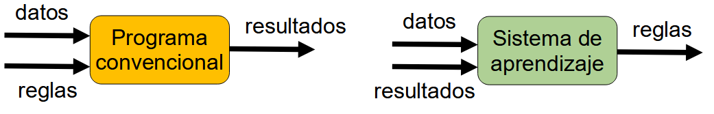

# 2. Machine Learning y Deep Learning

La **Inteligencia Artificial** ha evolucionado de forma increíble en los últimos años, y dos de sus ramas más importantes son **Machine Learning (ML)** y **Deep Learning (DL)**. Ambas permiten a las máquinas aprender a partir de datos, pero con enfoques distintos.

En esta unidad exploraremos:
* Qué es el Machine Learning y en qué se diferencia de la programación tradicional.
* Tipos de Machine Learning: supervisado, no supervisado y por refuerzo.
* Qué es el Deep Learning y en qué se diferencia del Machine Learning
* Entrenamiento de un modelo básico de Machine Learning con datos reales.

Al final, comprenderás cómo se entrenan los modelos de Machine Learning y habrás desarrollado tu propio modelo con Python. ¡Vamos allá!

## 2.1  ¿Qué es el Machine Learning?

El **Machine Learning (ML)** es una parte muy importante de la inteligencia artificial. De hecho, muchas veces se confunden ambos términos porque están muy relacionados. 

Se trata de una técnica que permite a los ordenadores aprender patrones a partir de datos sin necesidad de instrucciones específicas. En lugar de programar reglas fijas, se proporciona a la máquina una gran cantidad de datos para que ella misma identifique regularidades.

Gracias a esta tecnología, los sistemas pueden mejorar su rendimiento a lo largo del tiempo, volviéndose más precisos conforme reciben más información.

📌 **DATO CURIOSO:** el primer programa de Machine Learning fue creado en 1959 por Arthur Samuel, quien desarrolló un sistema que aprendía a jugar al ajedrez mejorando con la práctica. Su algoritmo se volvió tan bueno que llegó a vencer a jugadores humanos experimentados.

**¿Cómo se diferencia de la programación tradicional?**

En un programa convencional, el programador escribe un conjunto de reglas claras (como condiciones, bucles o instrucciones) para que, a partir de unos datos de entrada, se obtenga un resultado específico.

En cambio, en el aprendizaje automático, el enfoque es distinto: en lugar de definir reglas manualmente, se le proporciona al sistema datos de entrada junto con los resultados que deberían obtenerse. A partir de esta información, el sistema aprende por sí mismo a identificar patrones y deducir las reglas necesarias para predecir nuevos resultados cuando reciba datos diferentes en el futuro.

    

**Tabla resumen** 

<table>
    <tr>
        <th>Programación tradicional</th>
        <th>Machine Learning</th>
    </tr>
    <tr>
        <td>Se escribe código con reglas explícitas</td>
        <td>El sistema aprende patrones a partir de datos.</td>
    </tr>
     <tr>
        <td>Se necesitan muchas reglas para cubrir diferentes casos.</td>
        <td>Puede generalizar a nuevos datos sin reescribir el código.</td>
    </tr>
     <tr>
        <td>Es limitada cuando hay variabilidad o datos no estructurados.</td>
        <td>Es ideal para problemas complejos como visión por computadora o procesamiento de lenguaje natural.</td>
    </tr>
</table>

### 2.1.2 Tipos de machine learning

El aprendizaje automático se divide en tres grandes categorías:

* **Aprendizaje supervisado**
  * El sistema aprende a partir de ejemplos etiquetados. Se le proporcionan datos de entrada junto con la respuesta correcta (etiqueta).
  * *Ejemplos:* modelos que aprenden a clasificar correos electrónicos como spam o no spam, aplicaciones de reconocimiento de imágenes o asistentes virtuales que aprenden a responder preguntas.

* **Aprendizaje no supervisado**
  * El sistema no tiene etiquetas, sino que debe encontrar patrones en los datos por sí mismo.
  * *Ejemplos:* algoritmos que predicen los gustos de un usuario basándose en la música que escucha o las páginas web que visita, recomendándole contenido similar.

* **Aprendizaje por refuerzo**
  * El sistema aprende mediante ensayo y error, recibiendo recompensas por buenas decisiones. Con el tiempo, mejora su estrategia para obtener mejores resultados. 
  * *Ejemplos:* se usa mucho en videojuegos o en inteligencia artificial para robots, donde el sistema debe aprender a moverse o tomar decisiones basándose en la experiencia acumulada.
  
> 🔍 **Ejercicio:** Observa los siguientes ejemplos y clasifícalos según su tipo de Machine Learning:
> * Un sistema de IA que detecta fraudes bancarios.
> * Un chatbot que aprende a responder preguntas a partir de conversaciones previas.
> * Un algoritmo que recomienda música según tus canciones favoritas.

## 2.2 ¿Qué es el Deep Learning?

El **Deep Learning** es una técnica avanzada de *Machine Learning* que permite a los ordenadores aprender de manera más parecida a como lo hace el cerebro humano. Para lograr esto, se utilizan **redes neuronales artificiales**, un tipo de modelo matemático inspirado en el funcionamiento de las neuronas en nuestro cerebro.

**¿Cómo funcionan las redes neuronales?**

Las redes neuronales artificiales están formadas por capas de nodos (neuronas artificiales) que procesan la información:

* **Capa de entrada:** recibe los datos (por ejemplo, una imagen o un sonido).
* **Capas ocultas:** analizan la información y detectan patrones.
* **Capa de salida:** genera el resultado final (por ejemplo, identificar si una imagen muestra un perro o un gato).

Cuantas más capas tiene una red neuronal, más profundo es su análisis, lo que permite que el sistema aprenda de manera más precisa.

**Ejemplos de Deep Learning**

* **Diagnóstico médico:** en un modelo de Machine Learning clásico, introduciríamos manualmente datos como edad y presión sanguínea para predecir enfermedades. Con Deep Learning, el sistema analizaría directamente un informe médico en PDF y extraería la información relevante por sí mismo.

* **Clasificación de tomates:** en Machine Learning, introduciríamos características como color y tamaño de los tomates. Con Deep Learning, bastaría con una imagen del tomate y el sistema identificaría automáticamente los detalles para clasificarlo.

📌 **DATO CURIOSO:** Google Photos usa redes neuronales para reconocer rostros y objetos en tus fotos, permitiéndote buscar imágenes escribiendo palabras clave como "playa" o "perro" sin necesidad de etiquetarlas manualmente.

### 2.2.1 Diferencias entre ML y DL

<table>
    <tr>
        <th>Característica</th>
        <th>Machine learning</th>
        <th>Deep learning</th>
    </tr>
    <tr>
        <td>Entrada de datos</td>
        <td>Se requieren características definidas manualmente (ej. presión arterial, colesterol)</td>
        <td>Puede procesar datos sin estructurar, como imágenes o documentos PDF</td>
    </tr>
    <tr>
        <td>Procesamiento</td>
        <td>Usa algoritmos como regresión o árboles de decisión</td>
        <td>Usa redes neuronales con múltiples capas</td>
    </tr>
    <tr>
        <td>Volumen de datos</td>
        <td>Funciona con menos datos</td>
        <td>Necesita grandes volúmenes de datos</td>
    </tr>
    <tr>
        <td>Ejemplo</td>
        <td>Un modelo predice enfermedades a partir de datos médicos estructurados</td>
        <td>Un sistema analiza un informe médico en PDF y extrae información relevante automáticamente</td>
    </tr>
</table>

## 2.4 Entrenamiento de un modelo de Machine Learning

Para entrenar un modelo de Machine Learning, seguimos estos pasos:

1. Recopilar datos:
      * Ejemplo: recopilar 1000 imágenes de gatos y perros.
2. Preparar y limpiar los datos:
      * Ejemplo: ajustar tamaño de imágenes, eliminar datos duplicados.
3. Elegir un modelo y entrenarlo:
      * Ejemplo: usar una red neuronal para clasificar las imágenes.
4. Evaluar el rendimiento:
      * Ejemplo: medir qué tan bien el modelo identifica gatos y perros.
5. Optimizar y mejorar:
      * Ejemplo: ajustar parámetros para mejorar la precisión.

🎯 **Ejercicio práctico:** entrena un modelo básico con Teachable Machine o con Python usando la librería scikit-learn.

## RESUMEN

✅ El Machine Learning permite a las máquinas aprender patrones a partir de datos.
✅ Existen tres tipos principales: supervisado, no supervisado y por refuerzo.
✅ Se usa en numerosos sectores: salud, finanzas, entretenimiento, redes sociales, etc.
✅ Requiere datos limpios, entrenamiento y evaluación continua.
✅ Presenta riesgos como sesgos, privacidad y automatización del empleo.

Poner las diferencias entre el entrenamiento de nachine learning y deep learning
poner ejercicio guiado de teachable machine
y el código python para cladificar imagan
