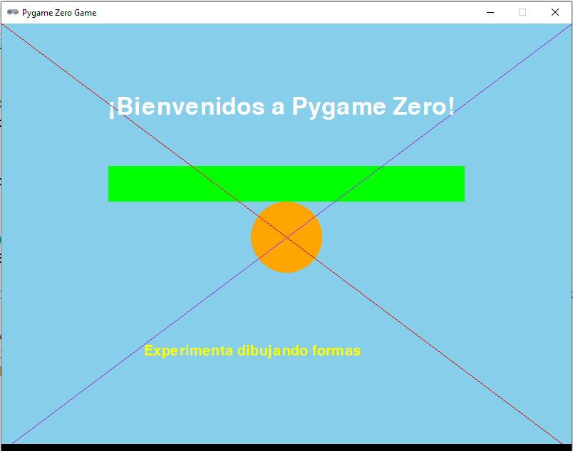

# 1. Primeros pasos con Pygame Zero

¡Bienvenidos al fascinante mundo de **Pygame Zero**! Si te gusta la idea de crear videojuegos 2D y ya sabes un poquito de Python, estás en el lugar correcto. Pygame Zero es una herramienta que te permitirá dar vida a tus ideas de videojuegos de forma muy sencilla y divertida. 

## 1. ¿Qué es Pygame Zero?

**Pygame Zero** es una versión más accesible y simplificada de **Pygame**, que está diseñada para que puedas empezar a hacer juegos 2D sin complicaciones. Lo mejor de todo es que usa Python, así que si ya conoces este lenguaje, te sentirás como en casa. No necesitas preocuparte por los detalles técnicos complicados, como configurar la ventana del juego o crear un bucle principal (que es el "corazón" que mantiene el juego funcionando). Pygame Zero se encarga de eso por ti, para que tú puedas concentrarte en lo más divertido: dibujar en pantalla, mover personajes y hacer que tu juego sea interactivo.


## 2. ¿Qué tipo de juegos puedes crear?

Con Pygame Zero, puedes hacer un montón de juegos diferentes. Aquí tienes algunas ideas:
* **Juego de plataformas tipo Super Mario:** un personaje que salta, recoge monedas y esquiva enemigos.
* **Juego de disparos:** donde controlas una nave espacial que destruye enemigos mientras evita obstáculos.
* **Juego de carreras:** con coches que se mueven en una pista, acelerando y esquivando otros vehículos.
* **Puzzles** al estilo Tetris o juegos de combinar piezas.
* **Aventuras gráficas:** juegos donde puedes interactuar con objetos y personajes usando el ratón, como en clásicos de los 90.

## 2. ¿Cómo empezar?

Lo primero que necesitas es **instalar Pygame Zero**. Es muy fácil:
1. Abre la consola  (haz clic en el **menú de Inicio** y escribe **cmd**)
2. Escribe este comando:

```py
pip install pgzero
```

¡Y listo! Ya tienes Pygame Zero instalado.

> **NOTA:** El comando PIP permite instalar herramientas adicionales en Python. En este caso, para obtener Pygame Zero, pero lo puedes usar para instalar otras muchas herramientas (es como una *"tienda de aplicaciones"* para Python). 

## 3. Estructura básica de un juego 

### 3.1 Dibujar una forma básica la pantalla

Vamos a empezar con algo sencillo: **dibujar un círculo en la pantalla** de nuestro juego. Para hacerlo, necesitas familiarizarte con dos elementos clave: la **función `draw()`** y el **objeto `screen`**.

**La función draw**

La `función draw()` es la encargada de dibujar todo lo que aparece en la pantalla. Todo lo que ves en un juego (personajes, fondos, objetos, etc) se dibuja a través de esta función. 

> **Importante:** Pygame Zero llama automáticamente a `draw()` cada vez que necesita actualizar la pantalla, tú solo debes preocuparte por qué dibujar y cómo hacerlo.

**El objeto screen**

El `objeto screen` es como el *"lienzo"* donde dibujas todo lo que aparecerá en tu juego. Cada vez que quieras mostrar algo, como personajes, fondos, objetos o incluso texto, lo harás a través de este objeto y sus funciones asociadas (¡tiene muchas!). 

De momento, vamos a centrarnos en las siguientes: 
* **Limpiar la pantalla:** `screen.clear()` borra todo lo que había dibujado antes. Esto es útil para que no se "ensucie" la pantalla cuando los objetos se mueven.
* **Dibujar un círculo:** `screen.draw.circle((x, y), radio, color)` dibuja un círculo en la posición (x, y), con un tamaño (radio) y un color que tú elijas.

**Ejemplo básico: Dibujar un círculo**

Aquí tienes el código para dibujar un círculo en el centro de la pantalla:

```py
# Importar la librería
import pgzrun

# Definir el tamaño de la ventana del juego
WIDTH = 800
HEIGHT = 600

def draw():
    screen.clear()  # Limpiar la pantalla
    screen.draw.circle((400, 300), 30, 'white')  # Dibujar un círculo blanco

pgzrun.go()  # Iniciar el juego
```

* Lo primero que hay que hacer es **importar la librería de Pygame Zero**, de lo contrario no podremos usar sus funciones. 
* A continuación, hay que **definir el tamaño de la ventana** del juego: con **WIDTH** y **HEIGHT**, establecemos que la ventana tendrá 800 píxeles de ancho y 600 de alto.
* Luego, se define la **función draw()**, que es la que dibuja todo lo que aparece en la pantalla. Primero limpia la pantalla con `screen.clear()` y luego dibuja un círculo blanco en el centro con `screen.draw.circle()`. En este caso, el círculo se dibuja en las coordenadas (400, 300), que están en el centro de la pantalla, con un radio de 30 píxeles, y el color es blanco.
* Finalmente, la función **pgzrun.go()** inicia el ciclo del juego. Esta función le dice a Pygame Zero que comience a ejecutar y mostrar el juego en la ventana. Sin esta línea, el juego no comenzaría, ya que es la que activa todo el proceso de dibujar y actualizar la pantalla.

### 3.2 Dibujar otras formas y texto

Una vez que has dibujado un círculo, puedes experimentar con otras formas y texto. 

* **Colorear la pantalla de un color sólido:** `screen.fill(color)` rellena la pantalla con un color sólido (por ejemplo, *'blue'*).
* **Dibujar un círculo:** `screen.draw.circle((x, y), radio, color)` dibuja un círculo en la posición (x, y), con un tamaño (radio) y un color que tú elijas.
* **Dibujar un círculo con un color de relleno**: `screen.draw.filled_circle((x,y), radio, color)` funciona igual que la función anterior, pero en este caso muestra el círculo relleno del color indicado.
* **Dibujar una línea:** `screen.draw.line((x1, y1), (x2, y2), color)` te permite dibujar una línea desde el punto inicial (x1, y1) hasta el punto final (x2, y2) con el color que elijas.
* **Dibujar un rectángulo:** `screen.draw.rect(Rect((x, y), (ancho, alto)), color)` dibuja un rectángulo con las dimensiones especificadas por (ancho, alto) en la posición (x, y).
* **Dibujar un rectángulo relleno:** `screen.draw.filled_rect(Rect((x, y), (ancho, alto)), color)` funciona igual que la función anterior, pero en este caso el rectángulo se dibuja relleno del color indicado.    
* **Escribir texto:** con `screen.draw.text('Texto que quieras', (x, y))` puedes escribir texto en la pantalla, lo cual es genial para mostrar puntuaciones o mensajes al jugador. Además, puedes personalizar aún más el texto utilizando argumentos opcionales como *fontsize* (tamaño del texto), *color* (color del texto) o *shadow* (sombreado del texto). Por ejemplo: *screen.draw.text('Puntuación: 100', (10, 10), color='yellow', fontsize=40)*

Prueba el siguiente ejemplo: 

```py
import pgzrun

# Definir el tamaño de la ventana del juego
WIDTH = 800
HEIGHT = 600

def draw():
    screen.clear()  # Limpiar la pantalla
    screen.fill('skyblue')  # Fondo azul cielo

    # Dibujar un rectángulo
    screen.draw.filled_rect(Rect((150, 200), (500, 50)), 'green')

    # Dibujar un círculo
    screen.draw.filled_circle((400, 300), 50, 'orange')

    # Dibujar líneas de un extremo al otro
    screen.draw.line((0, 0), (WIDTH, HEIGHT), 'red')
    screen.draw.line((0, HEIGHT), (WIDTH, 0), 'purple')

    # Dibujar texto en la pantalla
    screen.draw.text('¡Bienvenidos a Pygame Zero!', (150, 100), color='white', fontsize=50)
    screen.draw.text('Experimenta dibujando formas', (200, 450), color='yellow', fontsize=30)

pgzrun.go()
```

Obtendrás un resultado similar al siguiente: 

<div align="center">
    
</div>

### 3.3 Mostrar una imagen

Para mostrar una imagen, primero debes guardarla en la carpeta especial llamada **images**. Esta carpeta debe estar en el mismo directorio que tu archivo de código.

1. **Crear la carpeta `images`:**
    * Crea la carpeta en el mismo directorio que tu archivo .py. Asegúrate de que el nombre sea exactamente ese, ya que Pygame Zero busca las imágenes solo en esa carpeta.
    * Guarda la imagen en esa carpeta. El nombre del archivo debe estar en minúsculas y sin espacios. Si el nombre tiene varias palabras, usa guiones bajos, por ejemplo, mi_imagen.png.
2. **Mostrar la imagen:** 
   * Si ya tienes una imagen (como un personaje o un fondo) guardada, usa `screen.blit('nombre_imagen', (x, y))` para mostrarla en la posición que quieras en tu juego.

Descarga [esta imagen](https://github.com/maycalle/primero-bach/blob/653e12eb1fded264cac25d9d62361eac70d3d6f8/img/mapache_genial.png) y prueba este ejemplo: 

```py
import pgzrun

# Definir el tamaño de la ventana del juego
WIDTH = 800
HEIGHT = 600

def draw():
    screen.clear()  # Limpiar la pantalla
    screen.fill('lightblue')  # Fondo color azul claro

    # Mostrar la imagen divertida
    screen.blit('mapache_genial.png', (220, 200))

    # Texto para acompañar la imagen
    screen.draw.text("¡Mira esta imagen divertida!", (200, 100), color='black', fontsize=40)

pgzrun.go()
```

> **Ejercicio 1.** Pon a prueba tus conocimientos y haz lo siguiente: 
> * Limpia la pantalla.
> * Rellena la pantalla con un color de fondo.
> * Dibuja un texto en la parte superior.
> * Dibuja una línea roja y un círculo amarillo.
> * Carga una imagen en una posición específica


